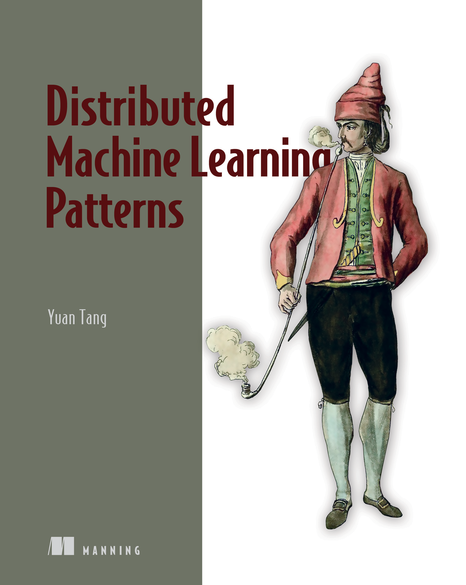

# Distributed Machine Learning Patterns

This repository contains references and code for the book *Distributed Machine Learning Patterns* from [Manning Publications](https://www.manning.com/) by [Yuan Tang](https://github.com/terrytangyuan).

:fire: **[The book is now available on the Manning Early Access Program](https://bit.ly/2RKv8Zo)**. You can read the book chapter-by-chapter while it's being written and get the final eBook as soon as it's finished. If you pre-order the pBook, you'll get it long before it's available in stores.

:bell: Stay tuned for any updates and announcements by following the author on [Twitter](https://twitter.com/TerryTangYuan) and [LinkedIn](https://www.linkedin.com/in/terrytangyuan/).

In *Distributed Machine Learning Patterns* you will learn how to:

* Apply patterns to build scalable and reliable machine learning systems.
* Construct machine learning pipelines with data ingestion, distributed training, model serving, and more.
* Automate machine learning tasks with [Kubernetes](https://kubernetes.io/), [TensorFlow](https://www.tensorflow.org/), [Kubeflow](https://www.kubeflow.org/), and [Argo Workflows](https://argoproj.github.io/argo-workflows/).
* Make trade off decisions between different patterns and approaches.
* Manage and monitor machine learning workloads at scale.

This book teaches you how to take machine learning models from your personal laptop to large distributed clusters. You’ll explore key concepts and patterns behind successful distributed machine learning systems, and learn technologies like TensorFlow, Kubernetes, Kubeflow, and Argo Workflows directly from a key maintainer and contributor. Real-world scenarios, hands-on projects, and clear, practical advice DevOps techniques and let you easily launch, manage, and monitor cloud-native distributed machine learning pipelines.

## About the topic

Scaling up models from personal devices to large distributed clusters is one of the biggest challenges faced by modern machine learning practitioners. Distributing machine learning systems allow developers to handle extremely large datasets across multiple clusters, take advantage of automation tools, and benefit from hardware accelerations. In this book, Yuan Tang shares patterns, techniques, and experience gained from years spent building and managing cutting-edge distributed machine learning infrastructure.

## About the book

*Distributed Machine Learning Patterns* is filled with practical patterns for running machine learning systems on distributed Kubernetes clusters in the cloud. Each pattern is designed to help solve common challenges faced when building distributed machine learning systems, including supporting distributed model training, handling unexpected failures and dynamic model serving traffic. Real-world scenarios provide clear examples of how to apply each pattern, alongside the potential trade offs for each approach. Once you’ve mastered these cutting edge techniques, you’ll put them all into practice and finish up by building a comprehensive distributed machine learning system.

## About the reader

For data analysts, data scientists, and software engineers familiar with the basics of machine learning algorithms and running machine learning in production. Readers should be familiar with the basics of Bash, Python, and Docker.

## About the author

Yuan Tang is currently a founding engineer at [Akuity](https://akuity.io/). Previously he was a senior software engineer at [Alibaba Group](https://www.alibabagroup.com/), building AI infrastructure and AutoML platforms on Kubernetes. He is a key maintainer and contributor to many of the technologies used in this book, including co-chair of Kubeflow as well as maintainer of Argo Workflows and TensorFlow. He is the co-author of *[TensorFlow in Practice](https://terrytangyuan.github.io/2017/02/12/tensorflow-in-practice-book-chinese/)* in Chinese, and author of the TensorFlow implementation of *[Dive into Deep Learning](https://d2l.ai/)*.
